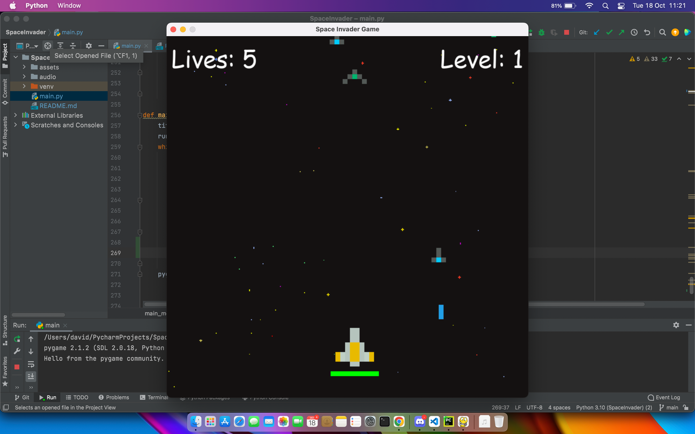

# Pygame-Space-Invader
A simple retro game created using Pythion/Pygame the Python modules designed for writing video games.

This simple game is called space invader or also known as space shooter. It is a game in which a spaceship
has to destroy other space ships in order to progress. You also have to try and not get shot because the main spaceship
(The player) has a certain amount of health, you must avoid the incoming bullets by moving around.

The controls for the game are the following: 
* A: &#8592; to move left
* S: &#8595; to move down
* D: &#8594; to move right
* W: &#8593; to move upwards
* Spacebar: to shoot

A screenshot of the game running is displayed below &#8595;

